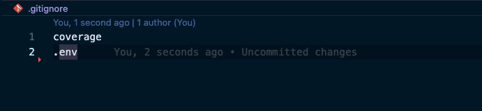

<div align="center">

# *Address Detective*

### _Transform your command-line into a Sherlock Holmes of sorts, capable of solving the mystery of any US address! Build a program that harnesses the power of an API to validate the authenticity of a US address, revealing its true identity or boldly declaring it 'Invalid'. Get ready to don your detective cap and solve the case of the US Address!_

<u>

## Table of Contents
</u>

[Setup / Installation](#setup--installation)<br>
[Running the Program](#running-the-program)<br>
[Testing](#testing)<br>
[Reasoning and Decision Making](#reasoning-and-decision-making)<br>
[Gems](#gems)<br>
[Testing](#testing)

<u>

_ENVIRONMENT_
</u>
</div>

This project used the  `VERSION 3.1.2` and was developed/tested with  `VENTURA 13.2.1`
<br>

<u>

## Setup / Installation
</u>

- Please note, any time `$` is in the command line prompt, that is to signify the beginning of a terminal command, do not include the `$` in the input
- To install the necessary software to run a ruby program, please follow the sub points below:
  - To install a version manager such as `rbenv` to easily switch between `Ruby` versions [rbenv tutorial](https://www.digitalocean.com/community/tutorials/how-to-install-ruby-on-rails-with-rbenv-on-macos)
  - Once a version manager is installed, install ruby using `$ rbenv install 3.1.2`
  - To install a bundler for the gems already in the file, run that by inputting `$ gem install bundler`
  - If the preference is all public methods' args and return types, there are some YARD files created to see just that.
    - In the terminal, run `$ yard server` and then go to url `http://localhost:8808/` in a browser window.
    - Feel free to click around on the different classes and see what each method in each class is doing

  _Now you are ready to move forward with this repo!_

- Clone this Git repository to your local machine [here](https://github.com/RyanChrisSmith/address_detective)
- `$ cd address_detective` into the repo
- Run `$ bundle install` to add all the gems
- Well, well, well, it looks like we have a secret agent in our midst! There's an API Key involved that's so top-secret, it doesn't even come with the repo! Gotta keep those classified files under lock and key, am I right?
  - Go to `https://www.smarty.com/products/us-address-verification` to get an `API key` and `Authorization token`, you will need this and once back I can direct you as to where they can go on your machine to stay safe and sound.
  - Create a file `$ touch .env` which should create an empty `.env` file at the root level of the files
  - In that `.env` file add your keys as pictured below, but put the keys in the spaces that are scratched out.

  

  - Make sure to label the keys exactly the same as in the screenshot `SMARTY_AUTH_ID` and `SMARTY_AUTH_TOKEN` so that the keys will work properly when the program is run
  - ONE LAST THING BEFORE YOU GO ANYWHERE! We have to protect *YOUR* keys too! Make sure to add `.env` file to your `.gitignore` file like pictured below


  

  - This way, the API keys will stay out of the commit history keeping them safe from prying eyes

### [Back to Table of Contents](#table-of-contents)

<u>

## Running the Program
</u>

- Once setup / installation is finished, it is time to run this beautiful program from your terminal
- Run `$ ruby runner.rb data/test_addresses.csv`
- The response you should see in the terminal will look like this:
```
143 e Maine Street, Columbus, 43215 -> 143 E Main St, Columbus, 43215-5370
1 Empora St, Title, 11111 -> Invalid Address
24 Second Avenue, San Mateo, 94401 -> 24 2nd Ave, San Mateo, 94401-3828
24 Second Avenue, San Mateo, 84405 -> Invalid Address
800 Middle Avenue, Menlo Park, 94025-9881 -> 800 Middle Ave, Menlo Park, 94025-5121
500 Arbor Road, Menlo Park, 94025 -> 500 Arbor Rd, Menlo Park, 94025-5132
123 N. Elm St, Springfield, 65802 -> Invalid Address
123 South Elm St, Springfield, 65802 -> Invalid Address
1 Main St, New York, 10001-1111 -> 1 Main St, New York, 10044-0052
1234 Random Rd, Smallville, 1234 -> Invalid Address
123 Long Street, City, ABCDE -> Invalid Address
1234 Second Street, Big City, 1234567 -> 1234 Second Street, Schenectady, 12345-0001
```
- Steps behind the scenes:
  - The program is reading from a static CSV file
  - Creating individual addresses out of each line
  - Sending that to a 3rd party API to verify the address
  - Receiving a response from the API of whether its valid or not
    - If it is valid it is giving you the official address with appropriate corrections
  - Then showing that response after the lamda or `->` with either the *corrected address* or `Invalid Address`

### [Back to Table of Contents](#table-of-contents)

<u>

## Reasoning and Decision Making
</u>

This program is an example of how to use various programming concepts, libraries, and APIs to build a tool that validates and corrects addresses using the SmartyStreets API.

At a high level, the program reads in a CSV file containing addresses, creates CsvAddress objects to represent each address, validates and corrects each address using the SmartyStreetsApi API, and outputs the corrected address in the console.

The program is structured using object-oriented programming (OOP) principles. The CsvAddress class encapsulates the concept of an address, providing methods to access and format its data. The CsvReader class is responsible for reading a CSV file and creating CsvAddress objects from its data. The SmartyStreetsApi class handles making HTTP requests to the SmartyStreets API and parsing its responses into usable data. Finally, the ResponseAddress class encapsulates the concept of an address returned from the SmartyStreets API.

The program also uses various libraries and APIs to accomplish its goals. The CSV library is used to read and parse the CSV file. The Faraday library is used to make HTTP requests to the SmartyStreets API. Finally, the dotenv gem is used to load environment variables containing the authentication credentials for the SmartyStreets API.

Overall, this program demonstrates how to use OOP principles, libraries, and APIs to build a tool that solves a specific problem: validating and correcting addresses. By following the Single Responsibility Principle, the program is easier to understand, easier to maintain, and easier to modify. Plus, it helps to avoid the dreaded "spaghetti code" - code that's so intertwined and convoluted that it's hard to tell what's going on.
### [Back to Table of Contents](#table-of-contents)

<u>

## Gems (Why these ones?)
</u>

[Bundler Audit](https://github.com/rubysec/bundler-audit) - used to scan a Ruby project's dependencies for known vulnerabilities and security issues

[DotEnv](https://github.com/bkeepers/dotenv) - loads environment variables from a .env file into the environment of a Ruby application, making it easy to manage sensitive configuration information such as API keys, passwords, and database credentials in a secure way without hardcoding them in the codebase.

[Pry](https://github.com/pry/pry) - provides a more powerful and interactive REPL (Read-Eval-Print Loop) console for debugging and exploring Ruby code.

[Rubocop](https://github.com/rubocop/rubocop) - provides a static code analyzer to enforce consistent coding style, best practices, and detect potential issues in a Ruby codebase.

[RSpec](https://github.com/rspec) - framework for writing and executing tests to ensure the expected behavior of a Ruby codebase.

[Simplecov](https://github.com/simplecov-ruby/simplecov) - provides code coverage analysis for a Ruby codebase.

[VCR](https://github.com/vcr/vcr) - provides a way to record and replay HTTP interactions between a Ruby application and an external API. This gem depends on WebMock (next gem) to intercept HTTP requests and responses, and provide the necessary stubbing and recording capabilities.

[WebMock](https://github.com/bblimke/webmock) - provides a way to stub HTTP requests and responses in Ruby tests

### [Back to Table of Contents](#table-of-contents)

<u>

## Testing
</u>

- _If you would like to run the test suite_
  - Run `$ bundle exec rspec` to execute the whole test suite
  - You will notice beyond the passing tests that `simplecov` is generating a Coverage Report. This helps to identify any code that was written is actually being tested. You can `$ open coverage/index.html` to see a visual representation of what is being covered.

- _If you would like to check the code for any known vulnerabilities_
  - Run `$ bundle audit check --update`
  - Using the update flag makes sure that the gem is checking with the most recently known advisories and vulnerabilities

- _There should be a fixtures folder within the spec folder_
  - That is there courtesy of the VCR gem
  - These are the recordings of the original API call that are then used in the subsequent times running the tests. This way, the actual API calls are limited after the test has been run the first time.
  - There is a cassette tape for every test that has `:vcr` in its `it` block description

- See below for a more specified explanation of each test file for each class


The code is a set of RSpec tests to test classes CsvAddress, CsvReader, and ResponseAddress for validating and processing addresses.

The CsvAddress class is tested to ensure that it is initialized with valid attributes (street, city, zip_code) and will create an object for each address from a CSV file, even if it has incomplete or whitespace values. It is also tested to return the complete address as a string and to raise an ArgumentError if any attributes are empty.

The CsvReader class is tested to ensure that it can retrieve all addresses from a test CSV file and return them as CsvAddress objects with the correct values for each attribute.

The ResponseAddress class is tested by sending a request to the SmartyStreets API to confirm an address, and then verifying that it returns the correct full response, street, city, and zip code attributes. It is also tested to return 'Invalid Address' if the csv address doesn't exist. The tests use a gem called VCR to record and replay HTTP interactions with the API.

The SmartyStreetsApi tests contains two main blocks: "happy path" and "sad path". The "happy path" block tests that the SmartyStreetsApi.confirm_address method returns the expected result when given valid input. It also uses VCR to record and replay the HTTP request/response interaction with the SmartyStreets API, so that the tests can be run repeatedly without hitting the API every time. The "sad path" block contains several test cases that simulate various error scenarios that can occur when using the SmartyStreetsApi.confirm_address method. These include testing for connection errors, timeout errors, invalid JSON responses, and various HTTP error responses, such as 401 Unauthorized, 402 Payment Required, and 500 Server Error. The tests use RSpec's expect and raise_error matchers to verify that the correct error is raised under each scenario.

### [Back to Table of Contents](#table-of-contents)

<u>

## Extension Ideas
</u>

- Wrap error handling for third party API responses to future proof for versions 2 and beyond
- Bulk look up of addresses rather than 1 at a time
- Write a CSV file for output rather than just in command line
- Handling other file types for initial input (pdf, json, yaml, xml)
- Error handling for input file issues (wrong headers, no commas, too many commas, weird encoding, strange characters, extra comma(s) in street attribute)

